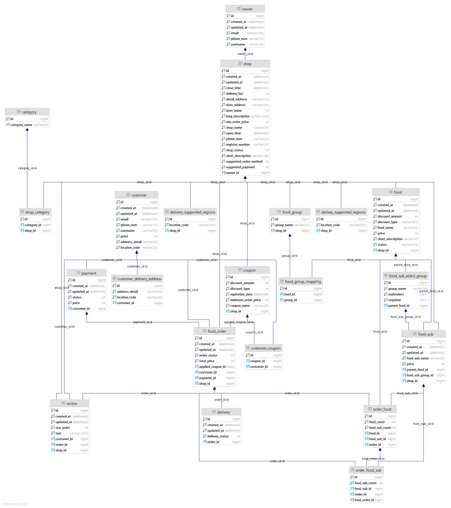

# 🚴‍♂️VAEMIN
백엔드 빅토리팀 소속의 배달의 민족 클론코딩 팀입니다!

---

## 🧑🏽‍🤝‍🧑🏻팀원 소개
||||
|:-------------------:|:--------------------:|:-------------------:|
|**박권규** `Product Owner`|**박수빈** `Developer`|**이하정** `Scrum Master`|

## 📍프로젝트 목표
- 실제 커머스 서비스를 분석하고 API를 클론해보면서 ...
- 스크럼 등 실무에서 사용하는 개발 방법론(애자일)을 통해 협업 역량 강화
- 상품 등록, 삭제, 주문 등 핵심 기능을 구현하며 커머스 도메인 지식 습득

## 🛠️개발 언어 및 활용 기술
### 개발환경
- IDE : **IntelliJ**
- 개발 언어 : **Java 11**
- 프레임워크 : **SpringBoot**
- 영속성 프레임워크 : **JPA**
- 빌드도구 : **Gradle**
- 데이터베이스 : **MySQL**
### 협업관리
- API 문서화 : **Spring Rest Docs**
- 이슈 관리 : **Jira**
- 커뮤니케이션 : **Slack / Gather**
- 버전 관리: **Git / Github**

## 🏗️설계
### 유저 스토리

### ERD 설계

### API 설계
[🔍VAEMIN API 설계 구경가기](https://backend-devcourse.notion.site/API-70273d8807d142bd84b976cc2a4afd8d)

## 🍁회고
[🔍VAEMIN 회고 구경하러 가보시렵니까?](https://backend-devcourse.notion.site/bb4a19e3e0a246a49b2b3d8277130db0)